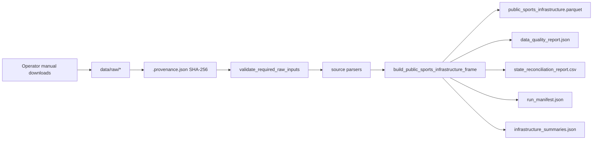
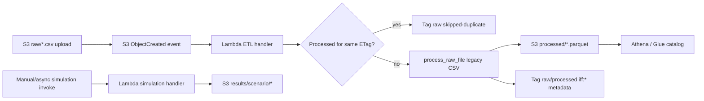
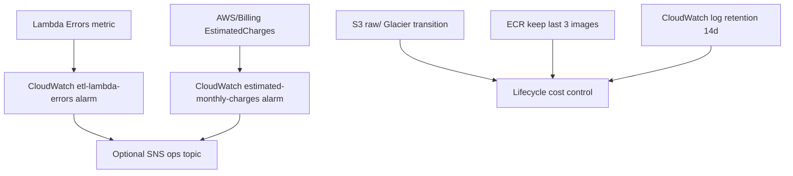

# Architecture

This repository supports two related flows: a **local provenance-validated reproduce path**
for state/UT public sports infrastructure analytics, and an optional **AWS event-driven**
path for legacy CSV ETL and illustrative simulation uploads.

## Local reproduce flow

Key properties:

- No dashboard scraping; only local files with sibling provenance metadata.
- Unmapped state/UT names fail the pipeline.
- Quality scorecard warnings are non-blocking by default.
- Simulation remains a separate, uncalibrated command (`iff-simulate`).

## AWS event-driven flow

Idempotency rules for ETL:

- Before processing, the handler checks whether the target processed object exists and carries
  the same `iff:source-etag` tag as the incoming raw object.
- Duplicate uploads with unchanged content are tagged `iff:processing-status=skipped-duplicate`
  and return HTTP 200 without reprocessing.
- Successful runs tag both raw and processed objects with processing status and source ETag.

## Observability and cost guardrails

Terraform resources:

- `infra/terraform/alarms.tf` — billing and Lambda error alarms
- `infra/terraform/s3.tf` — encrypted bucket, raw lifecycle, ETL notification
- `infra/terraform/tags.tf` — shared cost-allocation tags

## Module map

| Path | Role |
|---|---|
| `src/india_football_funnel/data/infrastructure_pipeline.py` | Primary reproduce build + manifest |
| `src/india_football_funnel/data/provenance.py` | Provenance validation and operator helpers |
| `src/india_football_funnel/data/quality_checks.py` | Runtime data-quality scorecard |
| `src/india_football_funnel/simulation/assumption_registry.py` | Versioned simulation assumption snapshot |
| `src/india_football_funnel/aws/lambda_handlers.py` | S3-triggered ETL + simulation handlers |
| `src/india_football_funnel/cli.py` | `iff-reproduce`, `iff-simulate`, `iff-provenance` |

See also: [metrics_glossary.md](metrics_glossary.md) · [data_inventory.md](data_inventory.md) · ADRs in [adr/](adr/)
