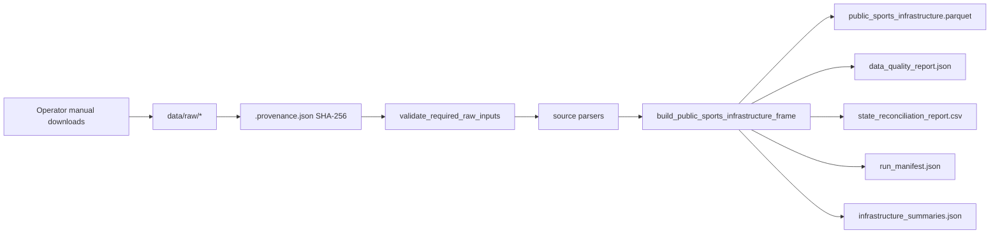
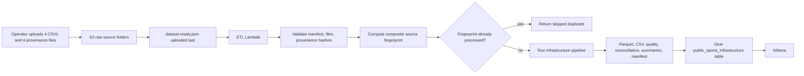
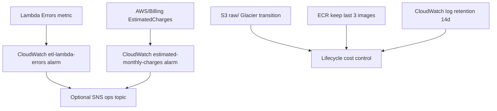

# Architecture

This repository supports two related flows: a **local provenance-validated reproduce path**
for state/UT public sports infrastructure analytics, and an optional **AWS manifest-triggered**
path that publishes the same artifact contract to S3.

## Local reproduce flow

Key properties:

- No dashboard scraping; only local files with sibling provenance metadata.
- Unmapped state/UT names fail the pipeline.
- Quality scorecard warnings are non-blocking by default.
- Simulation remains a separate, uncalibrated command (`iff-simulate`).

## AWS manifest-triggered flow

Idempotency rules for ETL:

- Lambda triggers **only** on `raw/dataset-ready.json`; individual CSV uploads are ignored.
- The ready manifest must list the exact eight required object keys (four CSV + four provenance JSON).
- Before processing, the handler checks whether `processed/public_sports_infrastructure.parquet`
  exists with the same `iff:source-fingerprint` tag derived from validated provenance SHA-256 values.
- Duplicate manifests with unchanged provenance are tagged `iff:processing-status=skipped-duplicate`
  and return HTTP 200 without reprocessing.
- Successful runs tag the ready manifest and processed parquet with fingerprint, processing status,
  and the published run-manifest key.

## Observability and cost guardrails

Terraform resources:

- `infra/terraform/alarms.tf` — billing and Lambda error alarms
- `infra/terraform/s3.tf` — encrypted bucket, raw lifecycle, manifest-only ETL notification
- `infra/terraform/glue_athena.tf` — `public_sports_infrastructure` Glue table + Athena workgroup
- `infra/terraform/tags.tf` — shared cost-allocation tags

## Module map

| Path | Role |
|---|---|
| `src/india_football_funnel/data/infrastructure_pipeline.py` | Primary reproduce build + manifest |
| `src/india_football_funnel/data/reproduce_artifacts.py` | Shared artifact writer for local and AWS runs |
| `src/india_football_funnel/aws/infrastructure_etl.py` | Manifest validation, fingerprint idempotency, S3 publish |
| `src/india_football_funnel/data/provenance.py` | Provenance validation and operator helpers |
| `src/india_football_funnel/data/quality_checks.py` | Runtime data-quality scorecard |
| `src/india_football_funnel/simulation/assumption_registry.py` | Versioned simulation assumption snapshot |
| `src/india_football_funnel/aws/lambda_handlers.py` | Manifest-triggered ETL + simulation handlers |
| `src/india_football_funnel/cli.py` | `iff-reproduce`, `iff-simulate`, `iff-provenance` |

See also: [metrics_glossary.md](metrics_glossary.md) · [data_inventory.md](data_inventory.md) · ADRs in [adr/](adr/)
